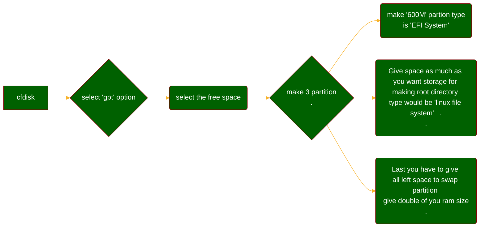

# Lets start 

In the world of Linux distributions, Arch Linux stands tall as a minimalist, flexible, and powerful operating system that caters to the preferences of experienced users. Installing Arch Linux is a rite of passage for those seeking to gain a deeper understanding of the inner workings of Linux and customize their system to their heart's content. In this blog post, we will embark on an adventure together, walking you through the steps to install Arch Linux and unlock the full potential of this remarkable distribution. If you are not linux geek like me then you can also installing via installing script but that’s not a fun way to install archlinux so lets start our Journay: 

# Step 1: Preparing for the Installation

Before diving into the installation process, it's crucial to gather the necessary resources. First, download the latest ***[Arch Linux ISO](https://archlinux.org/download/)*** from the official website. Ensure you have a reliable internet connection and a blank USB drive with at least 1 GB of storage space for creating a bootable installation media.

check the which is your usb drive by typing `sudo fdisk -l`  on linux in my case `/dev/sdc` then type the below command

```bash
sudo dd bs=4M if=path/to/the/archlinux.iso of=/dev/sdc
```

# Step 2: Booting into the Installation Environment

Insert the USB drive into your computer and boot from it. This step might require entering your system's BIOS or boot menu(F12, F11, search on google to know what is your boot menu key) and selecting the USB drive as the primary boot device. Once the Arch Linux boot menu appears, select "Boot Arch Linux" to begin the installation process.

# Step 3: Setting Up the Installation Environment

After booting into the Arch Linux live environment, you will be greeted with a command-line interface. Here, we'll need to configure the installation environment. Start by checking your internet connection with the `ping` command. If you're using a wired connection, it should already be active. For Wi-Fi, use the `iwctl` command to connect to your wireless network. Some time wifi is off then you have to type this command `rfkill unblock all`

# Step 4: Partitioning and Formatting Disks

Arch Linux allows you full control over partitioning your disk. Depending on your preferences and system requirements, you can use tools like `fdisk` or `cfdisk` to create partitions. I will showing you the cfdisk mathod: 



# Step 5: Change the file systems

```bash
mkfs.vfat /dev/sda2 # EFI system
mkfs.ext4 /dev/sda1 #Root partion 
mkswap /dev/sda3 && swapon /dev/sda3 #swap partition
```

# Step 6: Mounting the File Systems

Mount the root partition to the `/mnt` directory using the `mount` command. Additionally, if you have separate partitions for other directories like `/home`, `/boot`, or `/var`, mount them accordingly.

```bash
mount /dev/sda1 /mnt
```

# Step 7: Installing the Base System

Use the `pacstrap` command to install the base system packages onto your mounted partitions. These packages form the foundation of your Arch Linux installation. To create a basic setup, you can install the `base` package group. You can also customize your installation by adding additional packages or package groups to suit your needs.

```bash
pacstrap /mnt linux linux-firmware base base-devel vim dhcpcd networkmanager netctl
```

# Step 8: Configuring the System

Once the base system is installed, you need to generate the `fstab` file with the `genfstab` command. This file maps the file systems to mount points. Use the `-U` flag to specify UUIDs for disk identification, ensuring the correct partitions are mounted at boot.

```bash
genfstab -U /mnt >> /mnt/etc/fstab
```

# Step 9: Chrooting into the New System

Change the root into the newly installed system using the `arch-chroot` command. This step allows you to execute commands within the installed environment rather than the live environment. You are now operating within your newly minted Arch Linux system.

```bash
arch-chroot /mnt
```

# Step 10: Sync the hardware

```bash
hwclock --systohc
```

# Step 11: Adding a user

```bash
useradd "username"
```

### Adding password to the user

```bash
passwd "username"
usermod -aG wheel,storage,power "username"
```

# Step 12: Edit sudoers file

```bash
vim /etc/sudoers

```

### Uncomment the following line form the sudoers file

```bash
%wheel ALL=(ALL:ALL) All
```

# Step 13: Linking timezone

```bash
ln -sf /usr/share/zoneinfo/Asia/Kolkata /etc/localtime
```

# Step 14: Configuring the System Environment

Configure essential system settings, such as the time zone, locale, hostname, and network configuration. Use tools like `ln`, `locale-gen`, and `systemctl` to set up the desired environment.

### Lets create our hostname and host

```bash
echo Arch > /etc/hostname
vim /etc/hosts
127.0.0.1            localhost #use Tab for spaces
::1                  localhost
127.0.1.1            Arch.localdomain    localhost
```

### lets generate the locale

```bash
vim /etc/locale.gen
#Uncomment the 
en_US.UTF-8 UTF-8
echo LANG=en_US.UTF-8 > /etc/locale.conf
locale-gen
```

# Step 15: Installing a Boot Loader

A boot loader is necessary to start your Arch Linux system. The most popular option is GRUB (Grand Unified Bootloader). Install the `grub` package and configure it to suit your system's setup. Remember to run `grub-install`

```bash
pacman -S grub efibootmgr
grub-install --target=x86_64-efi --efi-directory=/boot/efi --bootloader-id=GRUB
grub-mkconfig -o /boot/grub/grub.cfg
```

chown -R “username” /home/”username”

At last enable these

`reboot` the system now your system is ready to install what ever environment you want gnome, kde, or you can also install cool window managers like awesomewm, bspwm, hyprland, sway etc


```bash
systemctl enable seatd
systemctl start seatd
usermod -a -G seat myusername
```

You can use a great hyprland config from ***[prasanthrangan](https://github.com/prasanthrangan)***

<video style="width:100%" controls src="https://user-images.githubusercontent.com/106020512/235429801-e8b8dae2-c1ad-4e23-9aa2-b1edb6cabe99.mp4" type="video/mp4">
</video>

<script type="module">
import mermaid from 'https://cdn.jsdelivr.net/npm/mermaid/dist/mermaid.esm.min.mjs';
mermaid.initialize({ startOnLoad: true });
</script>

